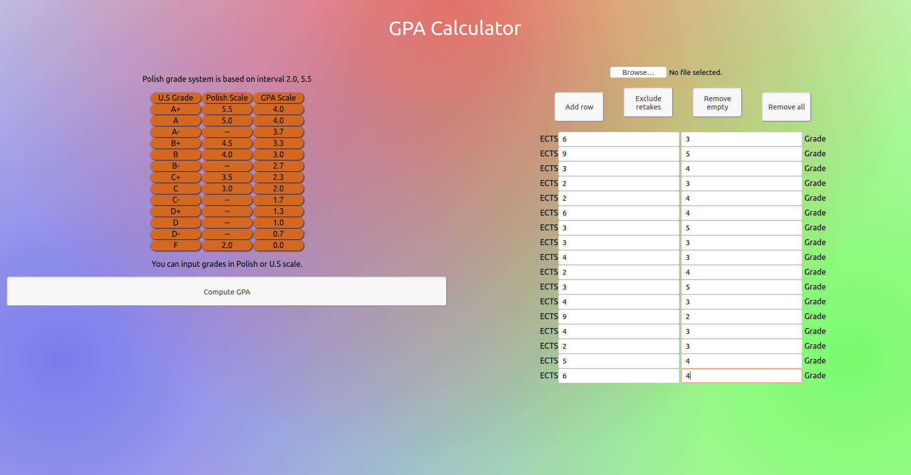
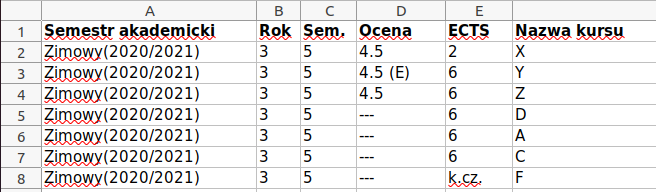
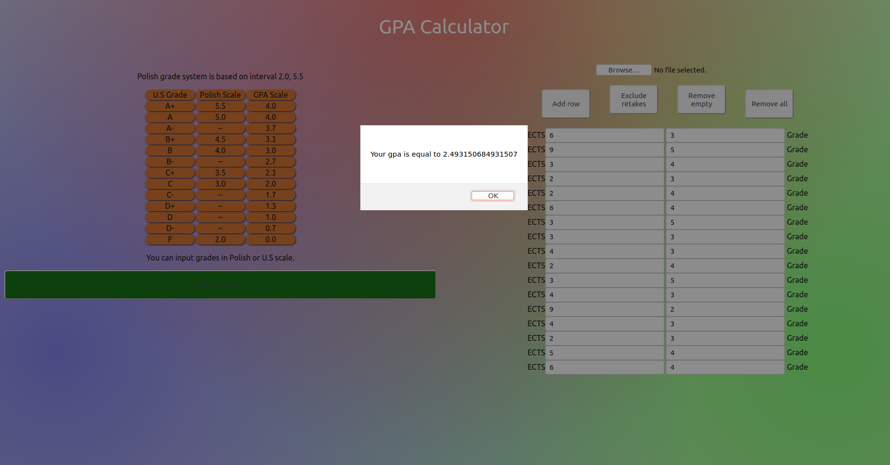

# Grade Point Average Calculator
## Table of contents

* [Introduction](#Introduction)
* [General info](#general-info)
* [Code Example](#code-example)
* [Launch](#launch)
* [Installation](#installation)
* [Technologies](#technologies)

## Introduction
React application to convert grades from Polish or U.S grades system to GPA world system and 
compute grade point average according to formula from Stanford University.

## General info
Grades can be inserted manually or you can input a file with xls extension. 
- There is a need to have your grades under column named 
'Ocena' and the ECTS or hours value under column called 'ECTS'.
- Rest of columns do not affect the performance of the application.
- The columns' order does not matter.


Program accepts XLS files generated straight from JSOS ( 
for Wrocław University of Science and Technology Students).

Data Sample if you do not want to enter it manually:


### Data formating:
- Wrong rows like "---" are being omitted.
- Values from rows like '(E)' are taken into account.

#### Example Results


## Code Example
```javascript 1.8
class InputComponent extends Component {
    state = {
        renderView: 0,
    };
    render() {
        return (
            <div className={"input-element"}>
                <label>ECTS<input class="ects-in" value={this.props.val_ects} type="text"></input></label>
                <label> <input class="grades-in" value={this.props.val_grade} type="text"></input> Grade</label>
            </div>
        );
    }
}
```


## Launch

In the project directory, you can run:
### `npm start`
Runs the app in the development mode.\
Open [http://localhost:3000](http://localhost:3000) to view it in the browser.

The page will reload if you make edits.\
You will also see any lint errors in the console.

### `npm test`

Launches the test runner in the interactive watch mode.\
See the section about [running tests](https://facebook.github.io/create-react-app/docs/running-tests) for more information.

## Installation
### `npm run build`

Builds the app for production to the `build` folder.\
It correctly bundles React in production mode and optimizes the build for the best performance.

The build is minified and the filenames include the hashes.\
Your app is ready to be deployed!

See the section about [deployment](https://facebook.github.io/create-react-app/docs/deployment) for more information.


## Technologies
- ReactJS
- Javascript
- Xlsx